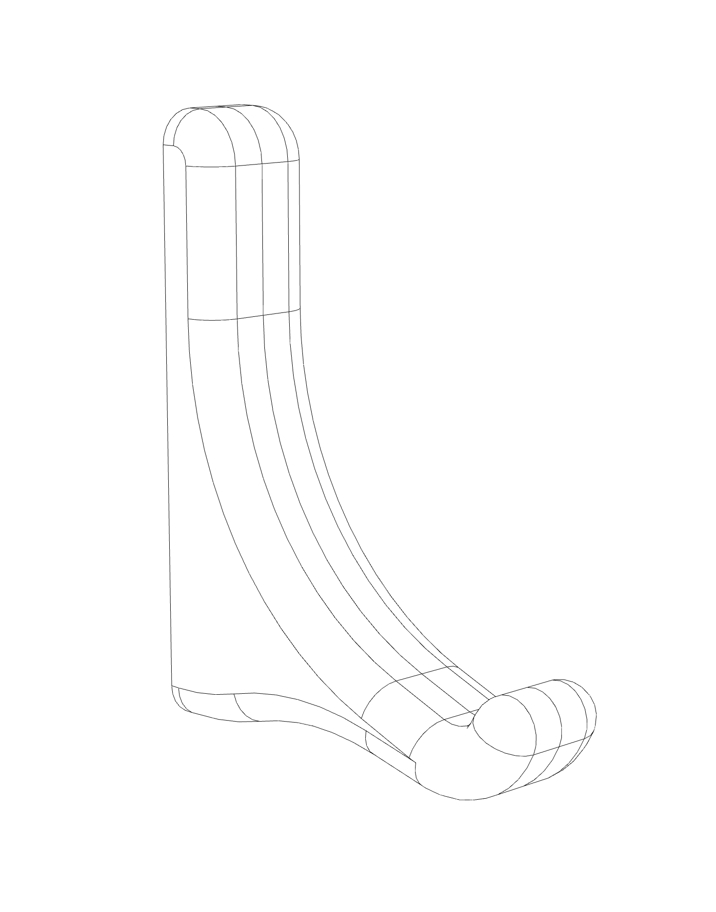
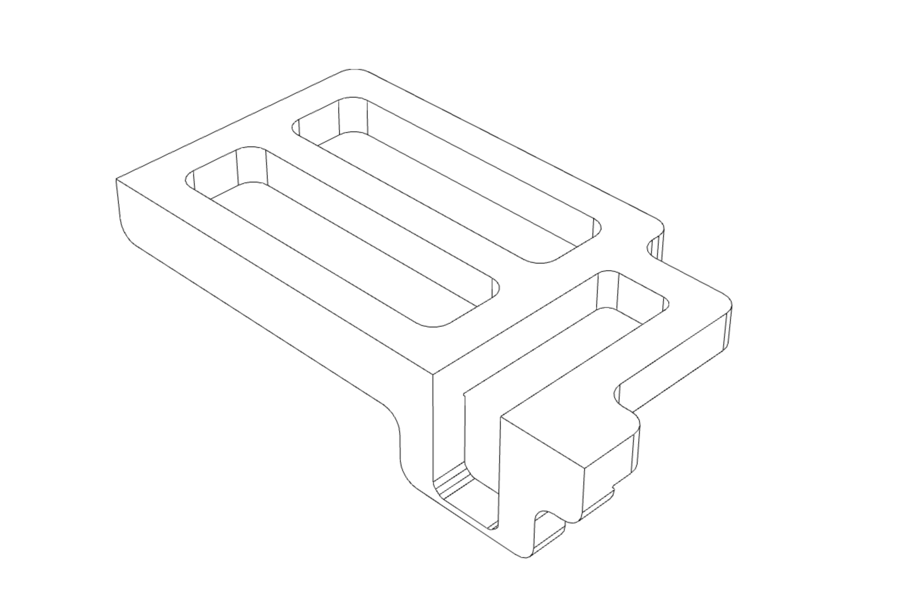
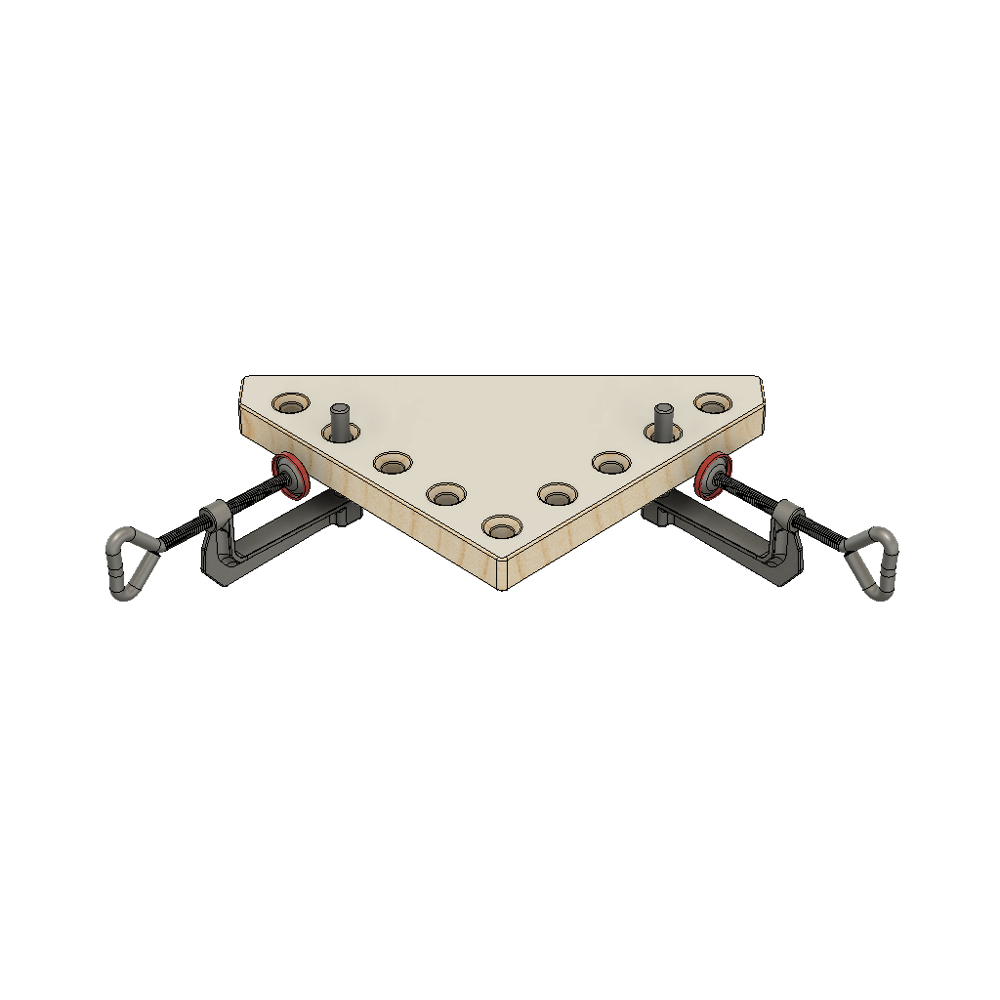
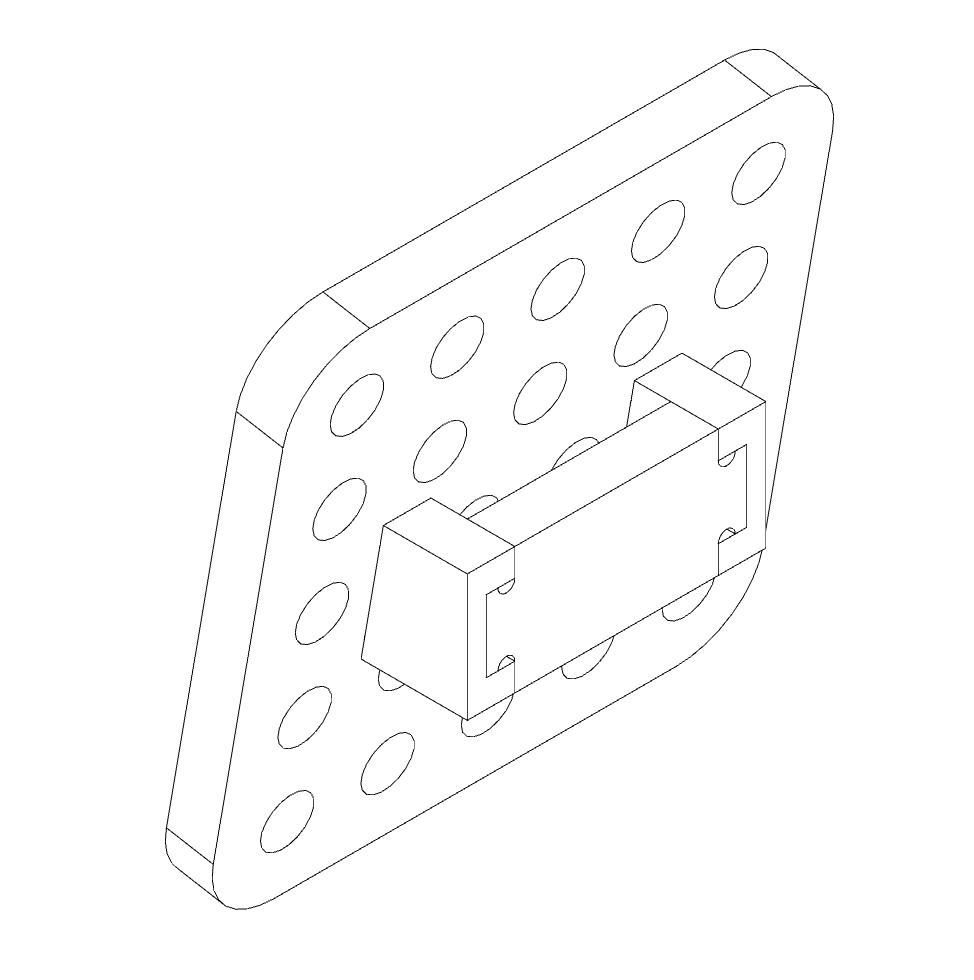
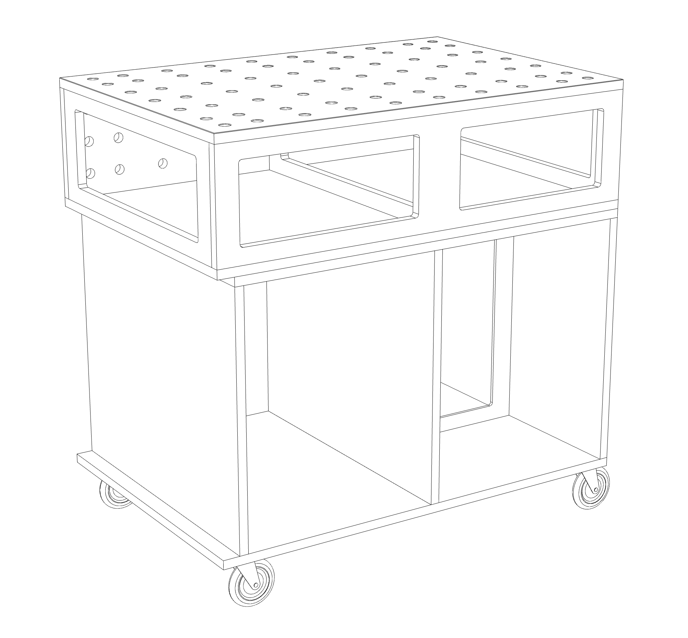
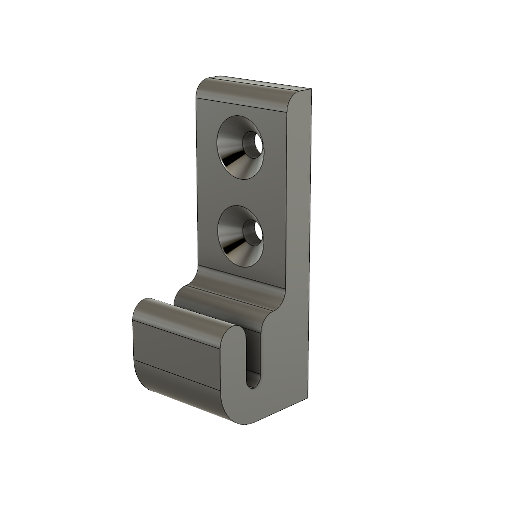
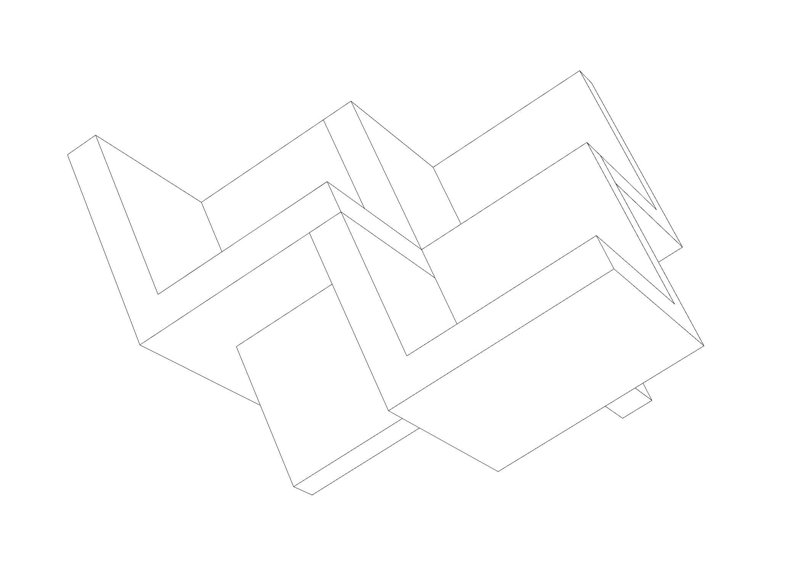
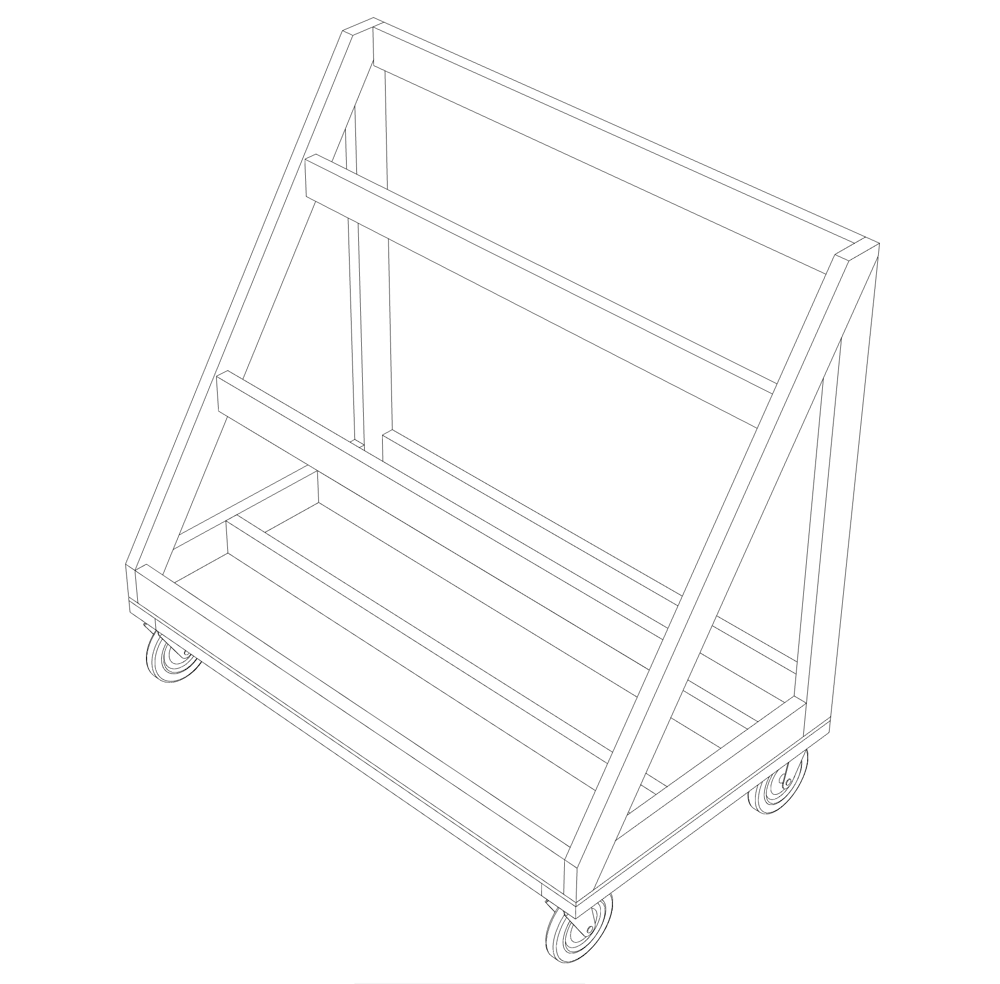
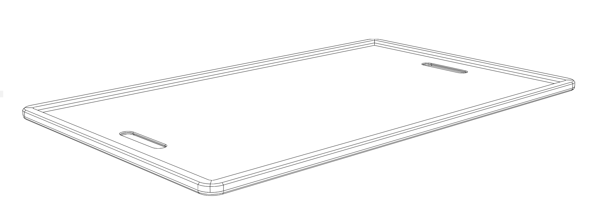
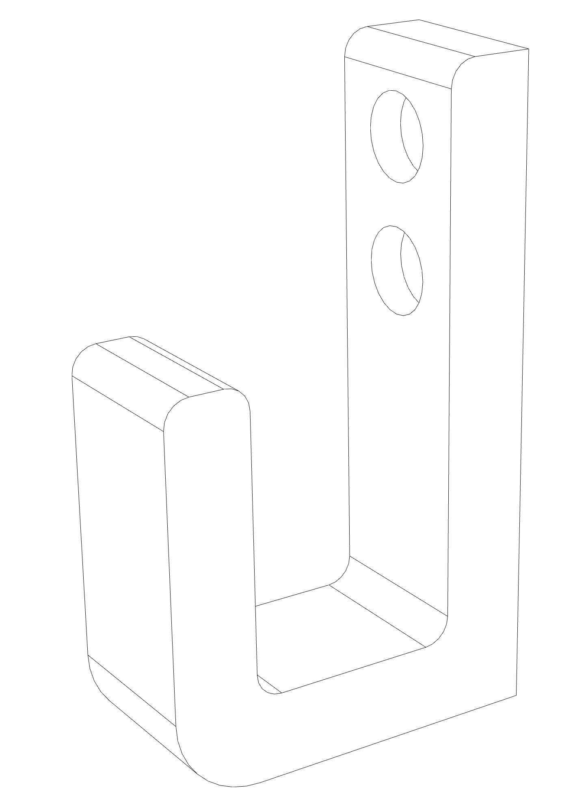

<!-- generated 2023-08-03 -->

# Project Plans

<p align="center">
  <a href="./plans/board-hook">
    
  </a>
  <a href="./plans/cross-lap-jig">
    
  </a>
  <a href="./plans/clamping-square">
    
  </a>
  <a href="./plans/dog-home">
    
  </a>
  <a href="./plans/euro-bench">
    
  </a>
  <a href="./plans/knew-hook">
    
  </a>
  <a href="./plans/origami-coffee-table">
    
  </a>
  <a href="./plans/scrap-cart">
    
  </a>
  <a href="./plans/snuffle-frame">
    
  </a>
  <a href="./plans/suizan-hook">
    
  </a>
</p>

## Development

### Layout

plans
└ <name>
  └ README.md
  └ model.f3d
  └ model.stl
  └ plans.pdf
  └ images
    └ wireframe.png
	└ ...

### Format

```bash
$ deno fmt
```

### Build

```bash
$ deno run --unstable --allow-env --allow-read --allow-write index.ts
```

## LICENSE

[MIT](./LICENSE)
