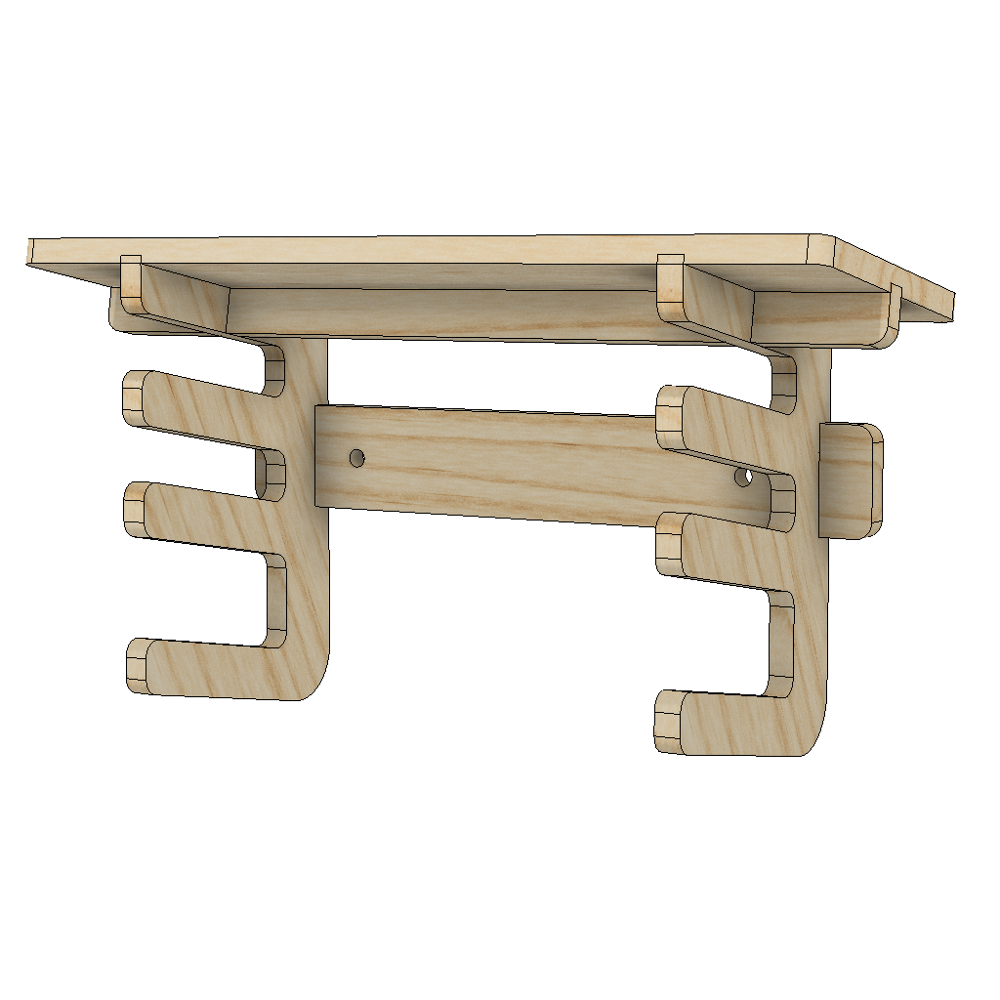
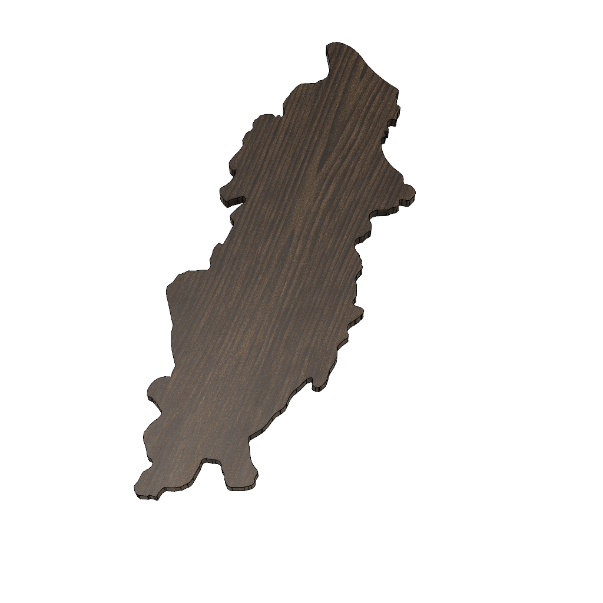

<!-- 2025-01-27 -->

# Project Plans

<p align="center">
  <a href="./plans/flagpole-driver">
    
  </a>
  <a href="./plans/pb-screwdriver-hook">
    
  </a>
  <a href="./plans/tv-console">
    
  </a>
  <a href="./plans/grs-holder">
    
  </a>
  <a href="./plans/pb-allen-holder">
    
  </a>
  <a href="./plans/tool-cabinet">
    
  </a>
  <a href="./plans/tool-shelf">
    
  </a>
</p>

## furniture

<p align="center">
  <a href="./plans/baby-bookcase">
    
  </a>
  <a href="./plans/bathroom-shelf">
    
  </a>
  <a href="./plans/bissell-stand">
    
  </a>
  <a href="./plans/blanket-ladder">
    
  </a>
  <a href="./plans/bookshelf">
    
  </a>
  <a href="./plans/woodman">
    
  </a>
  <a href="./plans/console-organizer">
    
  </a>
  <a href="./plans/pipi-hut">
    
  </a>
  <a href="./plans/potty-deck">
    
  </a>
  <a href="./plans/stool-stool">
    
  </a>
  <a href="./plans/tic-tac-toilet">
    
  </a>
  <a href="./plans/topper-block">
    
  </a>
  <a href="./plans/trotten-top">
    
  </a>
</p>

### workshop

<p align="center">
  <a href="./plans/battery-shelf">
    
  </a>
  <a href="./plans/clamp-rack">
    
  </a>
  <a href="./plans/dog-home">
    
  </a>
  <a href="./plans/euro-bench">
    
  </a>
  <a href="./plans/euro-shelves">
    
  </a>
  <a href="./plans/scrap-cart">
    
  </a>
  <a href="./plans/sharpening-mount">
    
  </a>
</p>

## objects

<p align="center">
  <a href="./plans/couch-clamp">
    
  </a>
  <a href="./plans/cutting-board">
    
  </a>
  <a href="./plans/vise-mount">
    
  </a>
  <a href="./plans/hub-sign">
    
  </a>
  <a href="./plans/lake-board">
    
  </a>
  <a href="./plans/mouse-house">
    
  </a>
  <a href="./plans/snuffle-frame">
    
  </a>
  <a href="./plans/wedding-band">
    
  </a>
</p>

### jigs

<p align="center">
  <a href="./plans/clamping-square">
    
  </a>
  <a href="./plans/euro-router">
    
  </a>
  <a href="./plans/shooting-board">
    
  </a>
</p>

### mounts

<p align="center">
  <a href="./plans/pb-rail">
    
  </a>
  <a href="./plans/saddle-mount">
    
  </a>
</p>

### tools

<p align="center">
  <a href="./plans/cauls">
    
  </a>
  <a href="./plans/screw-clamp">
    
  </a>
</p>

## prints

<p align="center">
  <a href="./plans/drill-guide">
    
  </a>
</p>

### mounts

<p align="center">
  <a href="./plans/block-plane-mount">
    
  </a>
  <a href="./plans/board-hook">
    
  </a>
  <a href="./plans/car-hook">
    
  </a>
  <a href="./plans/centrotec-mount">
    
  </a>
  <a href="./plans/dog-mount">
    
  </a>
  <a href="./plans/plane-mount">
    
  </a>
  <a href="./plans/jointer-plane-mount">
    
  </a>
  <a href="./plans/knew-hook">
    
  </a>
  <a href="./plans/m18-mount">
    
  </a>
  <a href="./plans/marking-hook">
    
  </a>
  <a href="./plans/no1-plane-mount">
    
  </a>
  <a href="./plans/no2-plane-mount">
    
  </a>
  <a href="./plans/rabbet-plane-mount">
    
  </a>
  <a href="./plans/scrub-plane-mount">
    
  </a>
  <a href="./plans/shooting-plane-mount">
    
  </a>
  <a href="./plans/suizan-hook">
    
  </a>
  <a href="./plans/wax-mount">
    
  </a>
  <a href="./plans/wood-is-good-hook">
    
  </a>
</p>

## Development

### Layout

```
- README.md*             | Generated sitemap.
- internal               | Code to manage this repository.
  └ gen.ts               | Entrypoint for generating docs.
  └ ...                  |
- plans                  | Folder containing all projects.
  └ example.info.json    | Example info file with all possible fields.
  └ <name>               |
    └ info.json          | Structured data about the project
    └ README.md*         | Generated project-level documentation.
    └ model.f3d          | Exported Fusion360 project.
    └ model.stl          | Exported 3d model.
    └ plans.pdf          | Written project instructions.
    └ images             |
      └ wireframe.png    | Square hero image summarizing the form.
    └ templates          |
      └ partA.svg        | Vector-based CNC paths for parts.
    └ ...                |
```

### Format

```bash
$ deno fmt
```

### Build

```bash
$ deno run --unstable --allow-env --allow-read --allow-write index.ts
```

## LICENSE

[MIT](./LICENSE)
