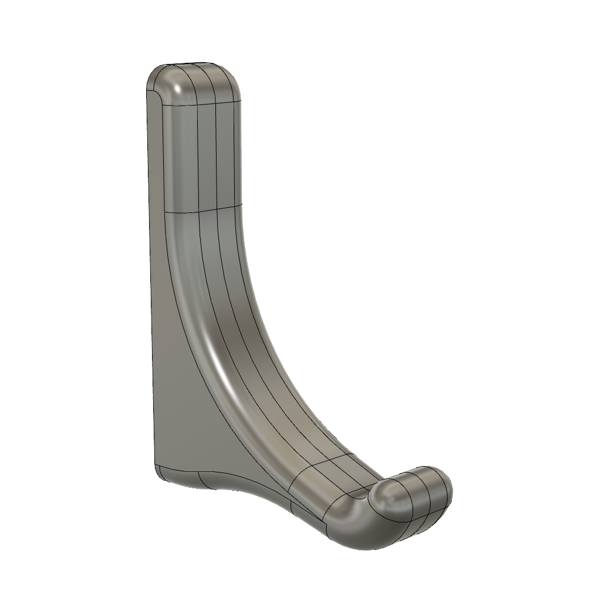

<!-- 2023-10-07 -->

# Project Plans

<p align="center">
  <a href="./plans/cross-lap-jig">
    
  </a>
  <a href="./plans/dog-home">
    
  </a>
  <a href="./plans/hub-sign">
    
  </a>
  <a href="./plans/clamping-square">
    
  </a>
  <a href="./plans/euro-bench">
    
  </a>
  <a href="./plans/knew-hook">
    
  </a>
  <a href="./plans/origami-coffee-table">
    
  </a>
  <a href="./plans/scrap-cart">
    
  </a>
  <a href="./plans/snuffle-frame">
    
  </a>
  <a href="./plans/suizan-hook">
    
  </a>
</p>

### prints
<p align="center">
  <a href="./plans/block-plane-mount">
    
  </a>
  <a href="./plans/board-hook">
    
  </a>
  <a href="./plans/plane-mount">
    
  </a>
</p>

## Development

### Layout

```
- README.md*             | Generated sitemap.
- internal               | Code to manage this repository.
  └ gen.ts               | Entrypoint for generating docs.
  └ ...                  |
- plans                  | Folder containing all projects.
  └ example.info.json    | Example info file with all possible fields.
  └ <name>               |
    └ info.json          | Structured data about the project
    └ README.md*         | Generated project-level documentation.
    └ model.f3d          | Exported Fusion360 project.
    └ model.stl          | Exported 3d model.
    └ plans.pdf          | Written project instructions.
    └ images             |
      └ wireframe.png    | Square hero image summarizing the form.
    └ ...                |
```

### Format

```bash
$ deno fmt
```

### Build

```bash
$ deno run --unstable --allow-env --allow-read --allow-write index.ts
```

## LICENSE

[MIT](./LICENSE)
