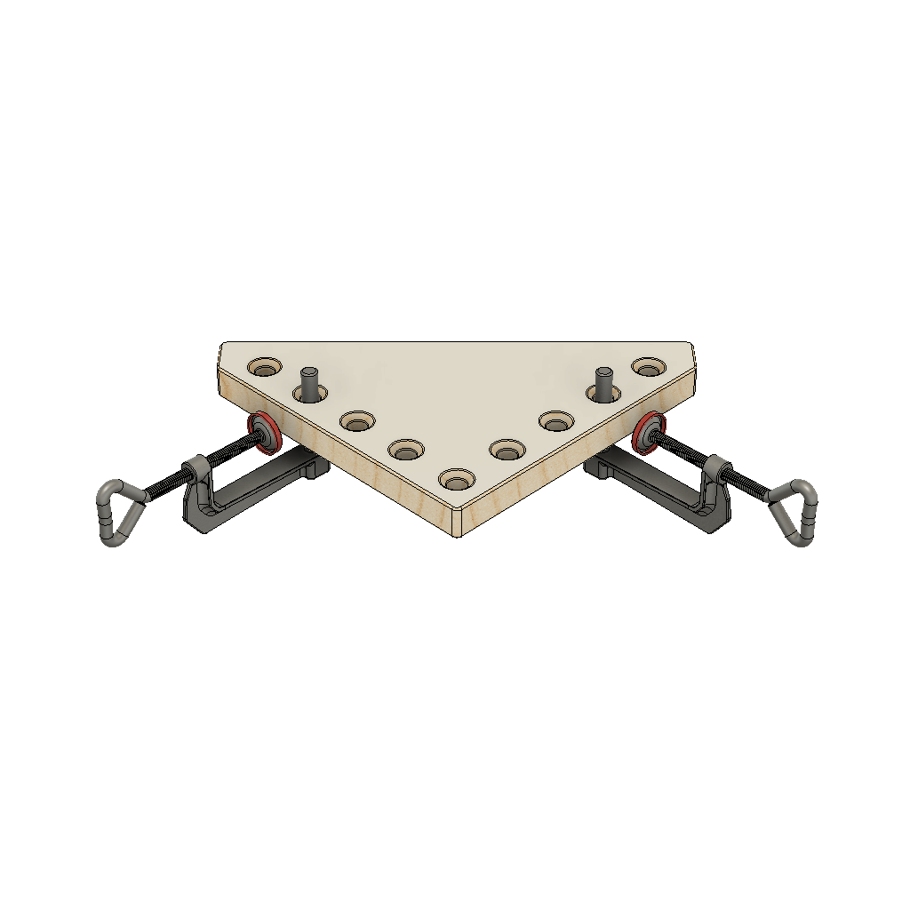
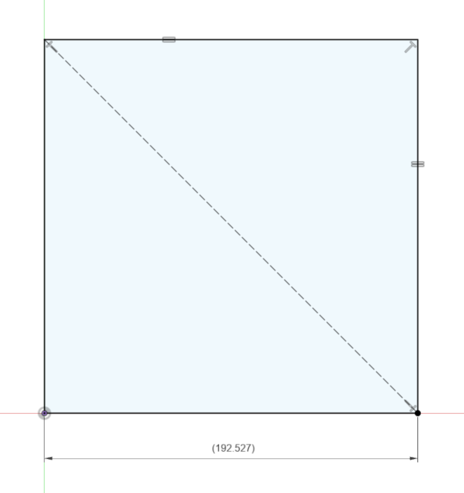
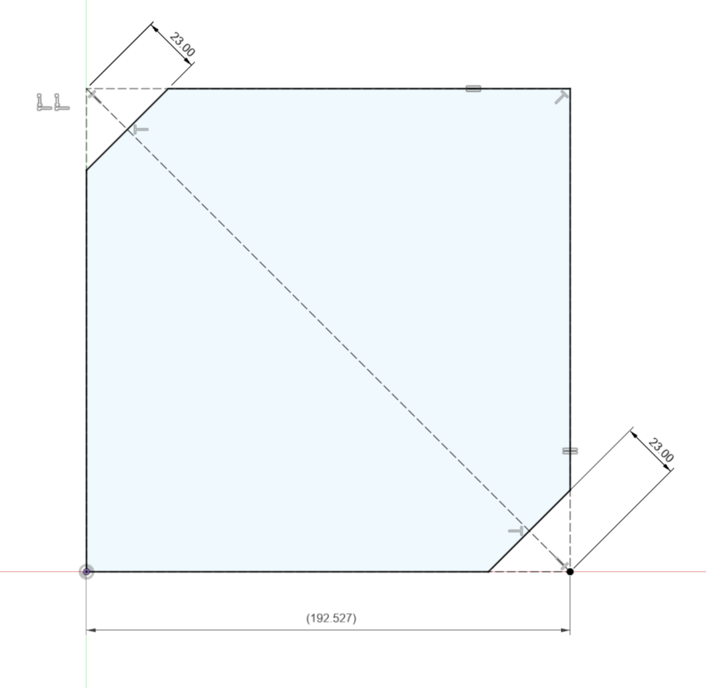
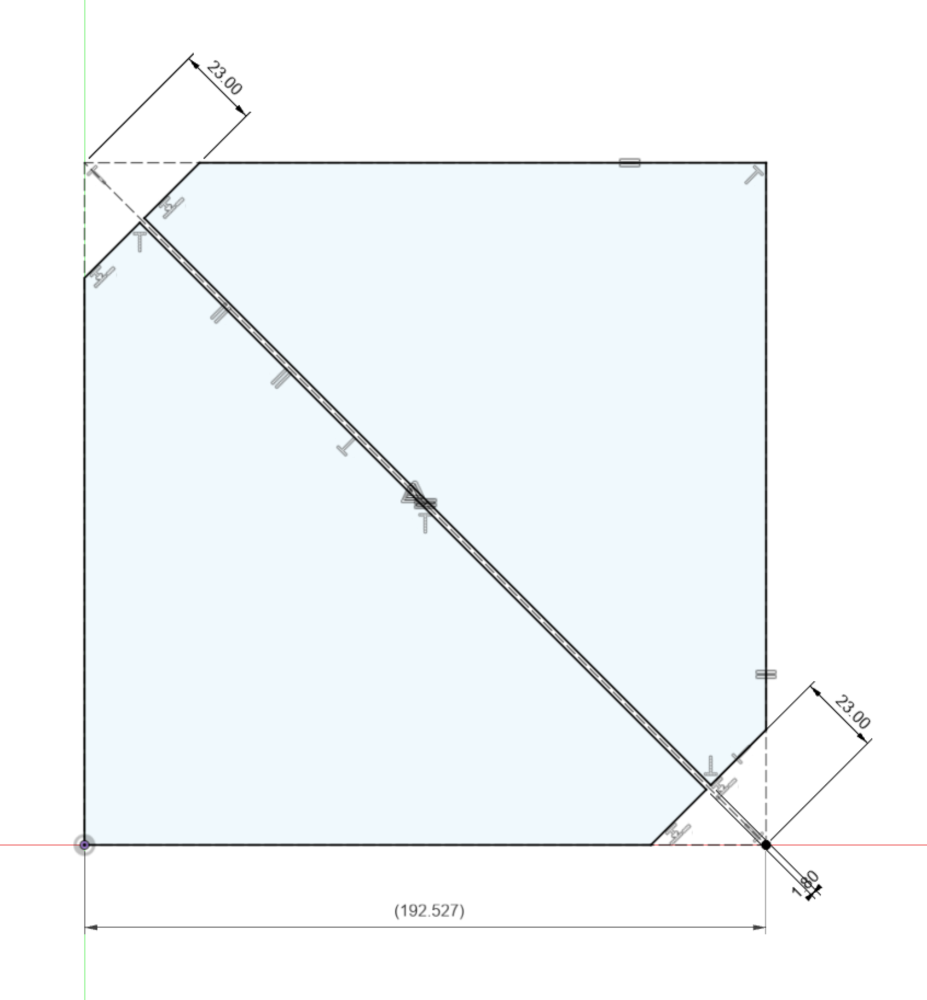
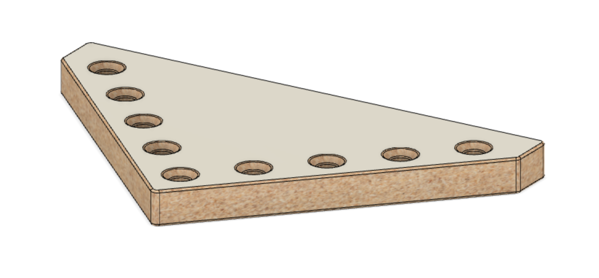

<!-- 2024-01-08 -->

  

<h1 align="center">
  Clamping Square
   
  90° clamping aides for Bessey TK-6 clamps.
</h1>

This clamping square was created as a lower cost alternative to the [Woodpeckers clamping squares + CSP clamps](https://www.woodpeck.com/clamping-squares-plus.html) and their multiple clones. The design comes with some tradeoffs:

- Can only be used/clamped on the inside of a joint and therefore cannot be used to line up butt joints.

- Both the square and the clamps are bulkier and harder to manipulate.

- Lower precision. Initially it is entirely dependent on the squareness of cut, but wood is more likely to change over time than aluminum.

- Squeeze-out may bond to the surface of the square if some countermeasures are not added (like packing tape).

## Supplies

_Makes two squares_

### Materials

- Scrap material about 3&#x2F;4&quot; thick and enough for a &gt;192mm square.
- 2x Bessey TK-6 clamps.

### Tools

- Saw
- Drill
- Sandpaper

## Steps

### 1. Cut a Square

Cut a square with roughly 192mm sides as precisely as possible

### 2. Split The Square

Pick two opposing corners and connect with a line.

### 3. Notch The Square

Cut off the same two opposing corners 23mm deep and perpendicular to th line.

### 4. Cut The Square

Cut the along the line centering it on the kerf.

### 5. Mark The Holes

Mark a line parallel to each face 16mm from the face. Then, measure and mark each hole position every 32mm referencing the faces.

### 6. Drill & Chamfer

Drill and chamfer 3/8" holes as perpendicular as possible. Also sand the corner between the two reference faces for glue clearance.

### 7. (optional) Packing Tape

Add some clear plastic packing tape to the reference surfaces to avoid gluing the square to your work.

## Inspiration

- https://www.woodpeck.com/clamping-squares-plus.html
