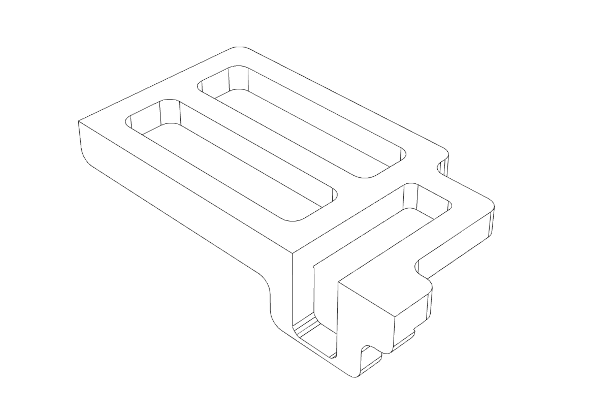

<!-- 2023-10-12 -->

  

<h1 align="center">
  Cross-Lap Router Jig
   
  Router jig for tic-tac-toilet joinery
</h1>

This jig was designed to be 3D printed with parameters adjusted for material thickness and width. It can be used for all the joinery, but requires finishing  work with a chisel to square up the dados.
