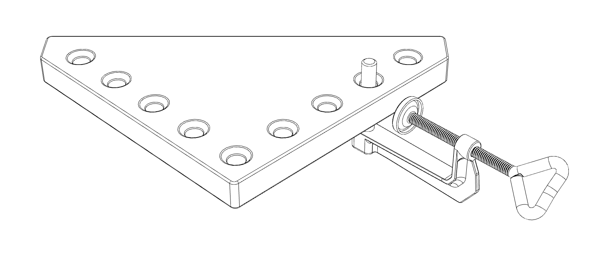
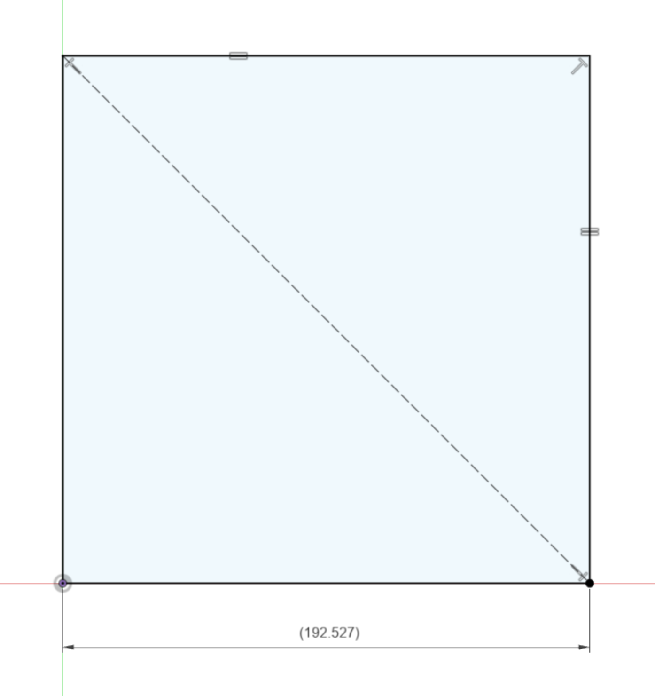
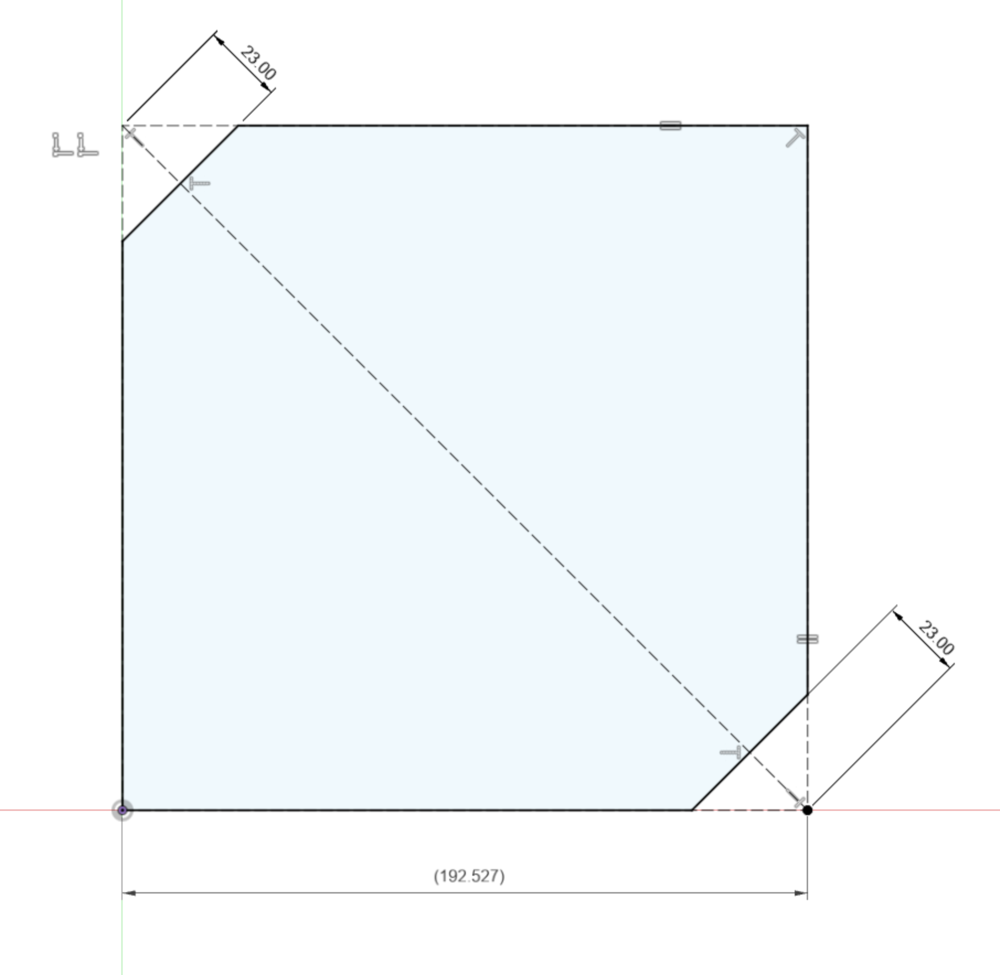
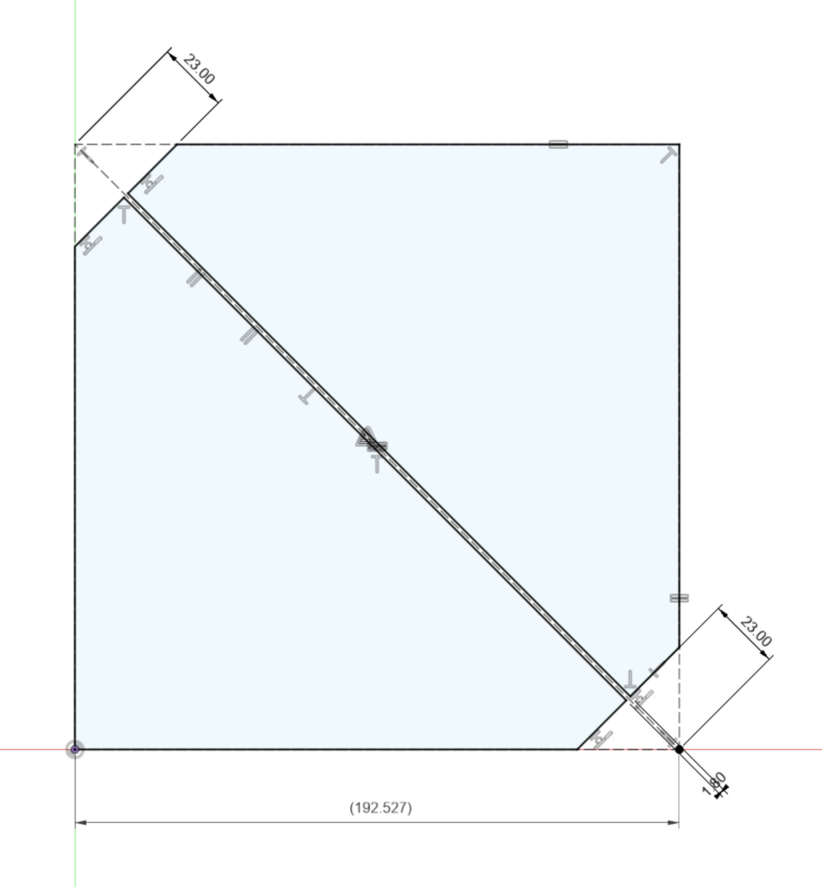
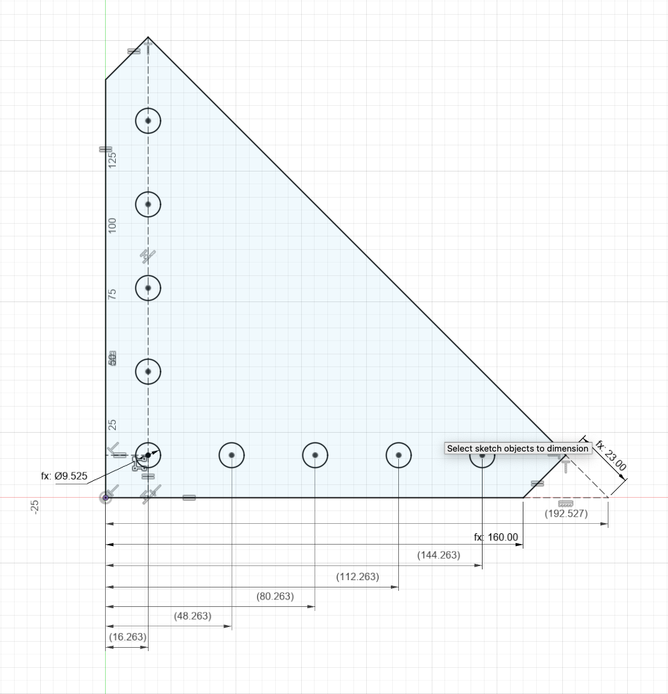
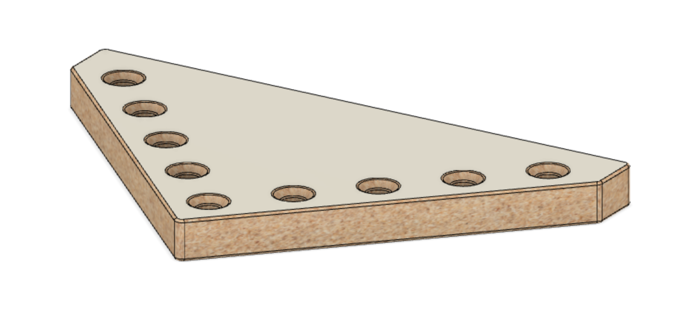
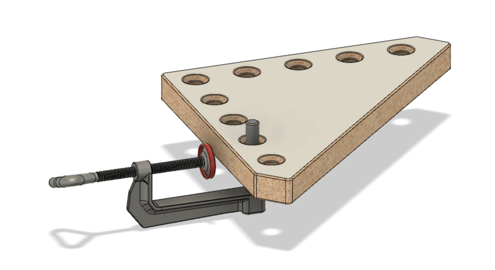
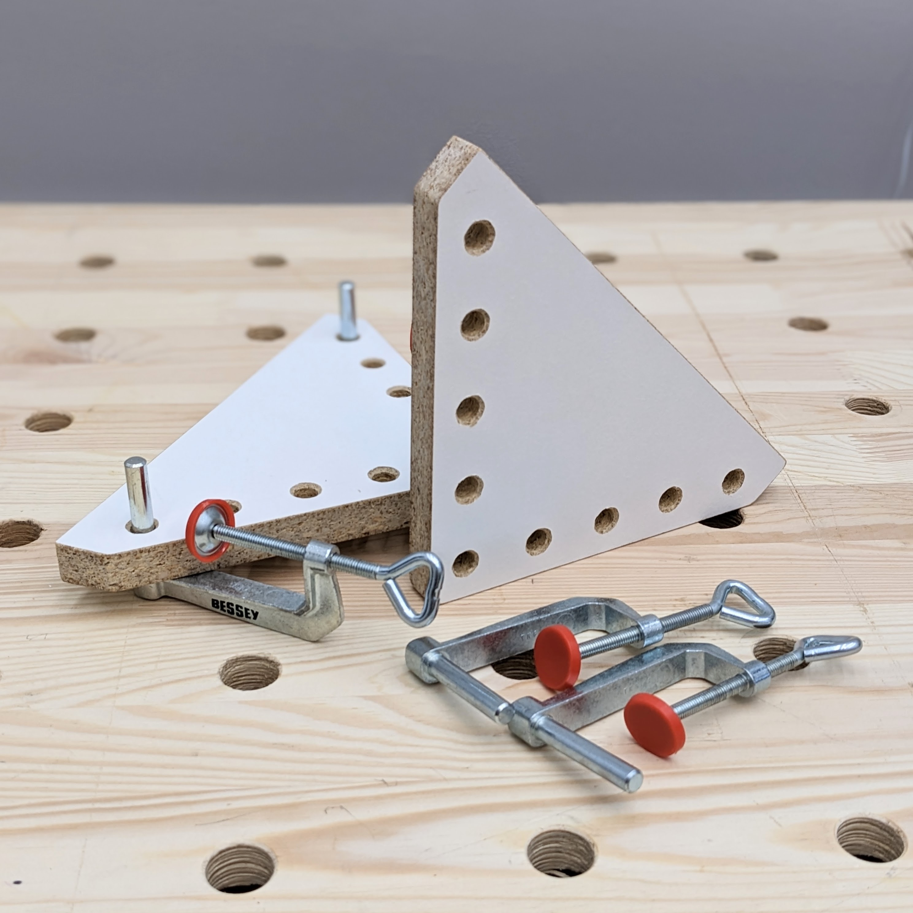
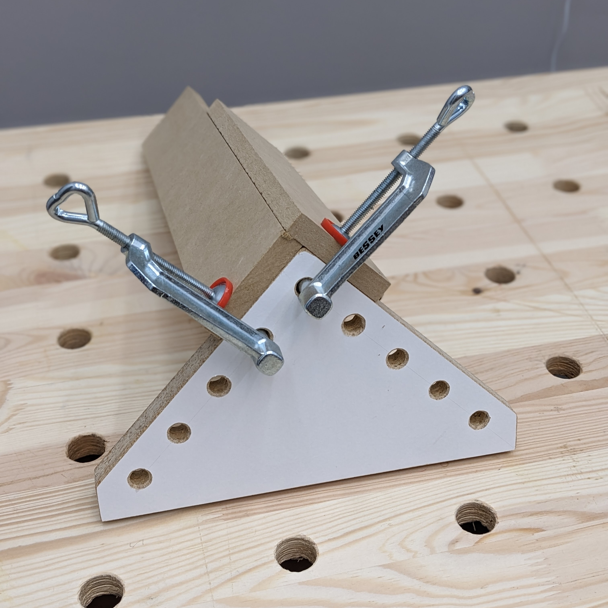

  

<h1 align="center">
  Clamping Square
   
  90° clamping aides for Bessey TK-6 clamps.
</h1>

This clamping square was created as a lower cost alternative to the
[Woodpeckers clamping squares + CSP clamps](https://www.woodpeck.com/clamping-squares-plus.html)
and their multiple clones. The design comes with some tradeoffs:

-   Can only be used/clamped on the inside of a joint and therefore cannot be used
    to line up butt joints.
-   Both the square and the clamps are bulkier and harder to manipulate.
-   Lower precision. Initially it is entirely dependent on the squareness of cut,
    but wood is more likely to change over time than aluminum.
-   Squeeze-out may bond to the surface of the square if some countermeasures are
    not added (like packing tape).

## Plans

_Makes two squares._

### Materials

-   Scrap material about 3/4" thick and enough for a >192mm square.
-   2x Bessey TK-6 clamps.

### Tools

-   Saw
-   Drill
-   Sandpaper

### Steps

#### 1. Cut a square with roughly 192mm sides as precisely as possible.

#### 2. Pick two opposing corners and connect with a line.

#### 3. Cut off the same two opposing corners 23mm deep and perpendicular to th line.

#### 4. Cut the along the line centering it on the kerf.

#### 5. Mark a line parallel to each face 16mm from the face.

#### 6. Measure and mark each hole position every 32mm referencing the faces.

#### 7. Drill and chamfer 3/8" holes as perpendicular and precise as possible.

#### 8. Remove a few mm of material from the corner between the reference surfaces.

#### 9. Sand all surfaces lightly to smooth edges, but avoid changing the shape.

