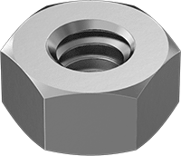
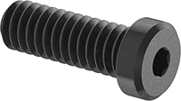
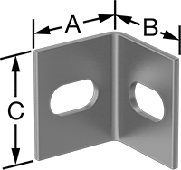
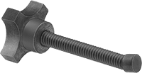
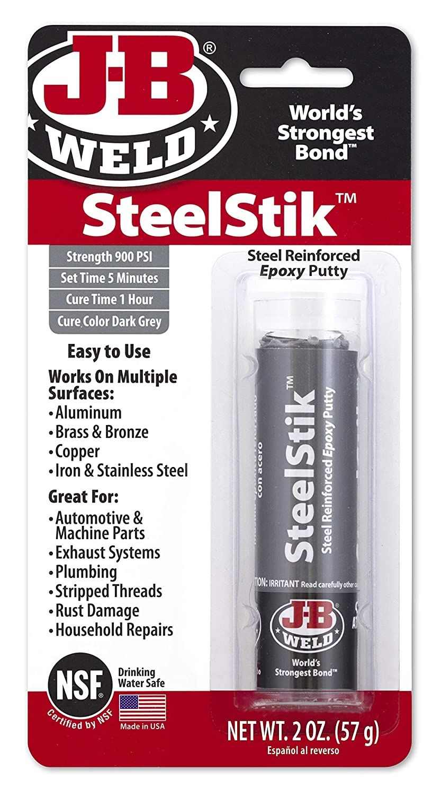

# Jig Clamp

> Clamping solution for JessEm doweling jig.

## Parts

<table>
    <tr>
        <td>
            
        </td>
        <td>
            <a href="https://www.mcmaster.com/catalog/90670A029">
                6061 Aluminum Hex Nut, 1/4"-20 Thread Size 
                90670A029
            </a>
        </td>
        <td>
            1 
            Pack of 100
        </td>
        <td>
            9.81 
            Pack
        </td>
        <td>$9.81</td>
    </tr>
    <tr>
        <td>
            
        </td>
        <td>
            <a href="https://www.mcmaster.com/catalog/92220A185">
                Alloy Steel Low-Profile Socket Head Screw, Hex Drive, Black Oxide, 1/4"-20 Thread Size, 3/4" Long 
                92220A185
            </a>
        </td>
        <td>
            1 
            Pack of 50
        </td>
        <td>
            12.42 
            Pack
        </td>
        <td>12.42</td>
    </tr>
    <tr>
        <td>
            
        </td>
        <td>
            <a href="https://www.mcmaster.com/catalog/2313N48">
                Corner Machine Bracket With 2 Mounting Slots, 6061 Aluminum, 1" x 1" x 1-1/4" 
                2313N48
            </a>
        </td>
        <td>
            2 
            Each
        </td>
        <td>
            7.81 
            Each
        </td>
        <td>15.62</td>
    </tr>
    <tr>
        <td>
            
        </td>
        <td>
            <a href="https://www.mcmaster.com/catalog/90747A170">
                Screw Clamp, 1/4"-20 Thread Size, 3-1/2" Long 
                90747A170
            </a>
        </td>
        <td>
            2 
            Each
        </td>
        <td>
            11.40 
            Each
        </td>
        <td>22.80</td>
    </tr>
    <tr>
        <td>
            
        </td>
        <td>
            <a href="https://www.mcmaster.com/catalog/90165A602">
                Plastic Tip For 1/4"-20 Swivel-Tip Screw 
                90165A602
            </a>
        <td>
            2 
            Each
        </td>
        <td>
            5.00 
            Each
        </td>
        <td>10.00</td>
    </tr>
    <tr>
        <td>
            
        </td>
        <td>
            <a href="https://amzn.com/dp/B00RN7CT2U">
                JB Weld Epoxy Putty
            </a>
        <td>
            1 
            2 oz Stick
        </td>
        <td>
            6.54 
            Each
        </td>
        <td>10.00</td>
    </tr>
</table>
